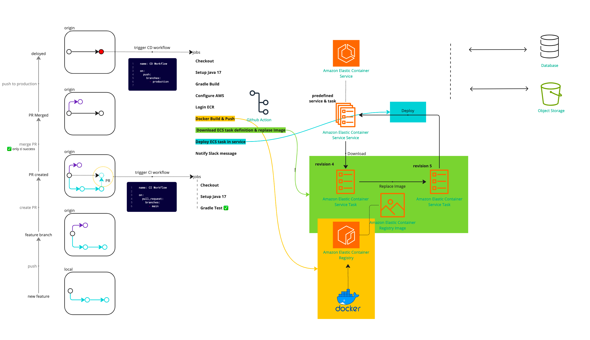
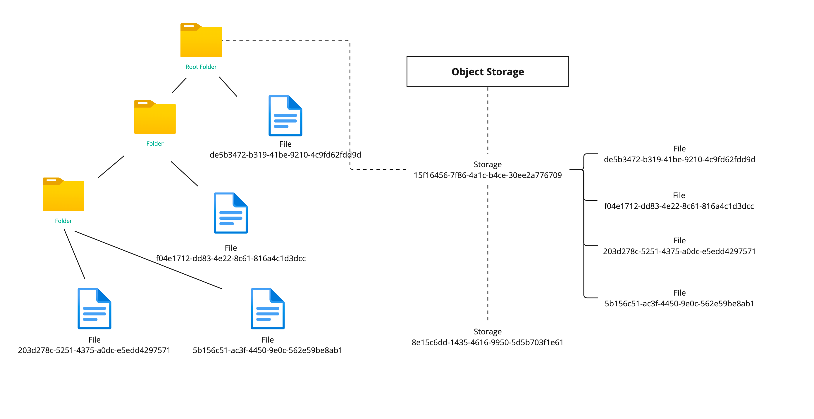
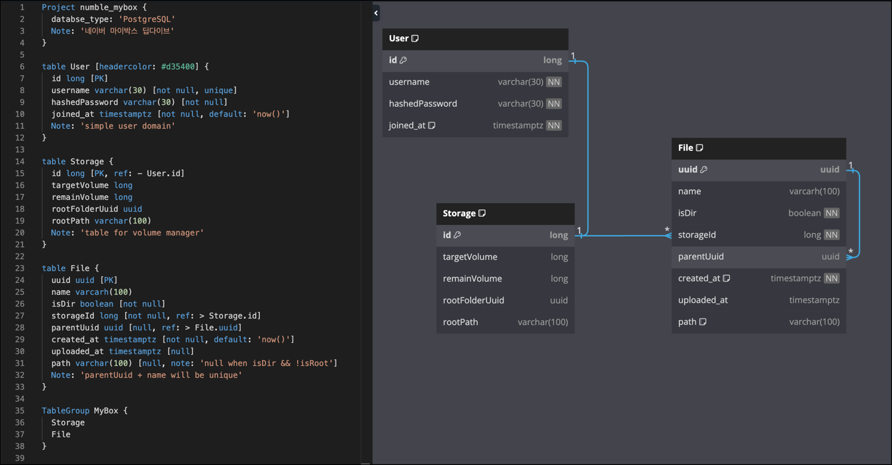
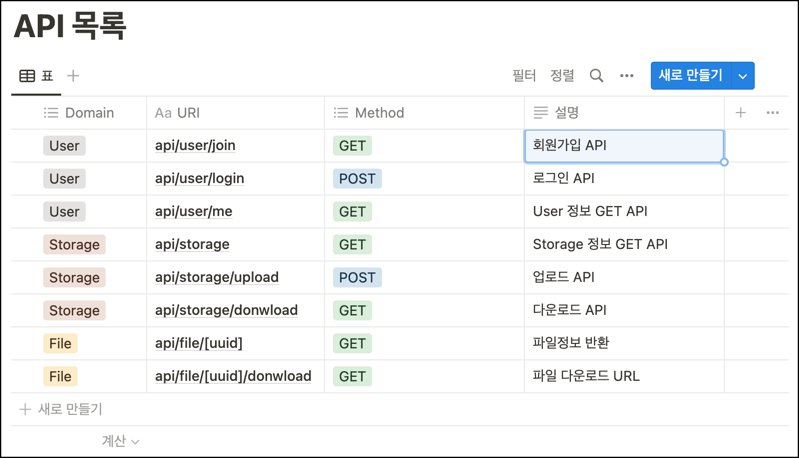
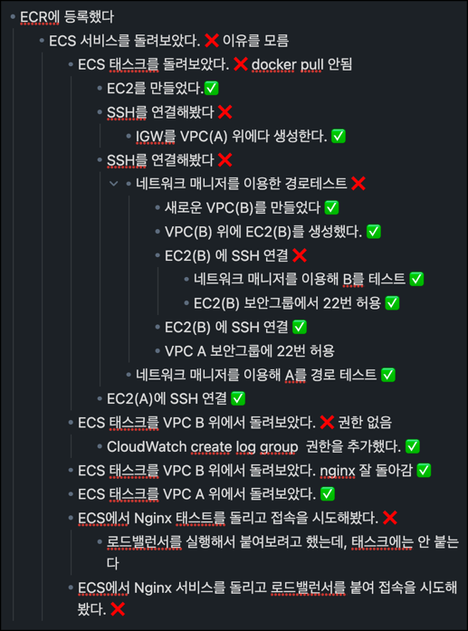

# 네이버 마이박스 딥다이브
'네이버 마이박스 딥다이브' 의 과제를 수행합니다. 

공식 과제 기간: 23.08.08 ~ 23.08.21

과제 요구 조건:
- 회원가입 후 파일을 업로드, 다운로드 가능할 것
- Object Storage (AWS S3, Ncloud Object Storage) 사용
- 업로드 시작시 정해진 용량에서 업로드 할 파일만큼 용량을 차감, 실패시 원복
- 파일 삭제시 용량 확보
- 같은 경로에 동일한 이름의 폴더나 파일 존재 불가
- depth 제한이 없을 것
- 폴더 다운로드시 폴더 이름으로 된 zip 파일로 다운로드 될것

스펙 요구 조건:
- CI/CD 필수
- 테스트 코드 70% 이상
- `Java > 8`, `Spring Framework > 5.3`, `Spring Boot > 2.6`
- Spring MVC
  - `PostgreSQL > 12` | `MySQL > 8`
  - `JPA` | `MyBatis`
- Webflux
  - `MongoDB > 4.2`
- 성능 테스트 `pinpoint` | `scouter`

## 제출물

Spring 을 처음 접하다 보니, CI/CD 만 완성하여 제출합니다.

- 서비스 주소:
  - [FirstLoadBalancer-2059202413.ap-northeast-2.elb.amazonaws.com](FirstLoadBalancer-2059202413.ap-northeast-2.elb.amazonaws.com)
  - [http://spring.papperbottle.com/health](http://spring.papperbottle.com/health)

- 아키텍처 구조도
- Storage 구조도
- ERD
- API 목록

### 아키텍처 구조도


### Storage 구조도


- Object Storage 내부에 유저가 소유한 Storage를 폴더로 생성합니다.
- 유저가 업로드하는 파일은 모두 1D Depth 로 해당 폴더에 업로드 됩니다.

### ERD


### 가상 API


### 회고

#### 느낀점 1. CI는 쉽고, CD는 어렵다

Spring 의 CI는 비교적, 컴파일이라는 강력한 장치가 있기 때문에 gradle build 가 되는지 확인하고, test 역시 잘 갖춘 구조를 가지고 있기 때문에 비교적 간단한 CI 구성하는 데에는 무리가 없었습니다.

CD를 구현하는 과정에서, 동작에 필요한 JAR 을 빌드하여 이를 Docker 로 패키징 하는 것은 쉬웠습니다. ECR에 올리는 것도 성공했으나, 첫 ECS 를 열기까지 굉장히 오래걸렸습니다. 

ECS는 클러스터>서비스>태스크 로 정의되는 구조를 가지고 있습니다. 배포의 경우 서비스와 태스크는 ECR에 올라간 첫 이미지로 미리 만들어두고, 이후 ECR에 새로운 이미지를 넣으면서 해당 태스크의 리비전을(* 복제본. 태스크는 갱신이 되지 않습니다) 만든 뒤 이를 이용해 서비스를 업데이트 하는 과정입니다.

이 과정에서 정말 다양한 에러를 만났습니다. 권한이 없어 ECR pull 이 안되는 경우 부터, 이미지는 받았으나, health check 설정을 하지 않아 서비스가 정상동작중이지 알 수 업는 경우. VPC는 만들었으나 (IGW) 인터넷 게이트웨이를 연결하지 않아, 서비스로 연결되지 않는 장애. 뵤얀그룹에서 22번 포트를 열지 않아 VPC 내의 EC2 서비스로 포트연결을 할 수 없었던 경우 등을 만났습니다.

이러한 일을 할때 강력하게 느끼는 점은 실제 배포를 하기 위해서는 VPC, 네트워크 구조 지식 뿐만 아니라, 다양한 에러상황에서 이러한 에러가 어느 지점으로부터 파생됬는지 여러가지 툴과 단서를 통해 알아볼 수 있는 능력이 필요하다는 것을 알게됩니다.
보통 이러한 능력은 경험에서 비롯된다고 생각하는데, 그렇기에 필요하는 태스크보다 작은 단위의 태스크나 비슷한 서비스 환경에서 겪었던 경험들이 도움이 되는 것 같습니다.

ECS의 경우 수십번 서비스를 다시 만들어보며 작동이 되지 않는 이유를 찾았고, 결국 찾긴 했지만, 이러한 문제상황에 보다 전문화된 인력이 Devops 라는 것을 다시 한번 깨닫습니다.



저는 Nginx 를 배포해 보며 Application LoadBalancer, Target Group, 리스너, IGW, 보안 그룹, IAM, TaskDefinitionFamily, ECSCluster, ECSService 등의 개념을 눈에 익혔고, 결국 NameCheap DNS에 CNAME Record 를 등록하며 서비스를 Web에 배포할 때 성취감을 맛볼 수 있었습니다.

#### 느낀점 2. 배우는데 시간이 오래걸리는 스프링

spring의 profiles 기능을 이용하여 applicaion-prod.yml 에 다른 환경을 분리하고, `${}` 구문을 통해 외부에서 환경변수를 받을거라고 정의한 뒤, java 파일을 실행할 때 지정하는 법을 알기까지 생각보다 오래걸렸습니다. 

```bash
# OS ENVIRONMENT VARIABLE ARE DEFINED
ENV=prod java -jar app.jar --spring.profiles=prod 
```

다른 웹 프레임워크는 친절한 튜토리얼이 있어 원리를 다 알지 못해도 비교적 빠른 시간내에 API를 구현 할 수 있는 반면, Spring을 알아가는 대에 사용했던 문서들은 대부분 공식문서가 아닌 Spring 사용자들이 남긴 블로그가 대부분이였습니다.
좋은 키워드를 찾아 좋은 블로그를 검색하면 빨리 해결 할 수 있겠지만, 돌아가는 방법을 기재한 블로그나, 오래된 버전의 블로그를 만나면 여러번 삽질하며 방법을 알아내야 합니다.

JAVA를 정식으로 배우지 않고 스프링을 구현하려고 한 저를 자책하며, 스프링은 그럼에도 불구하고 스프링은 다양한 디자인 패턴과, 컴파일이 가능한 구조, 오랜시간 발전을 이루었다는 점에서 좋은 아키텍처에 대한 고민을 한 자료가 많습니다. 이를 위해 스프링을 배우기로 결심했던 만큼, 조금 더 천천히 배워가려고 다짐합니다.


#### 느낀점 3. 나만 힘든 것은 아니다.

Numble 팀플을 처음으로 참여하여 팀장을 맡게 되었습니다. 6명의 팀원 중 2명이 자진하고, 그중 사다리타기로 뽑히게 되었지만, 아는 것이 없었기에 걱정이 되었었습니다.

팀장을 맡으며 잘 할 수 있을까에 대한 고민을 많이 했는데, 잘 모르더라도 내가 오늘 고민한 것과 나눌 이야기, 그리고 어려운점을 가지고 팀원들과 이야기하다 보면, 나만 어려운 것은 아니고 모두가 고생하고 있다는 사실을 알게됩니다.

이런 분위기에서 서로 격려하고 작은 것에 칭찬하다 보면, 내가 무언가를 모른다는 점이 더 이상 겁나기보다, 모두가 모르는 시절이 있고, 내가 어려웠던 것은 팀원도 어렵다는 것을 알게되어 도움을 주고자 노력하게 바뀌는 것 같습니다.

저도 팀원들의 긍정적인 모습과 여러가지 팁들에 도움을 받고, 스프링 강의 및 기타 추천을 받으며 프로젝트에서 도움을 받았습니다.

다만 이번 과제는 난이도가 있던 도전과제였던 만큼 실력자이신 분들은 분위기를 파악한 뒤 조기에 개인활동으로 전환하시거나 팀빌딩이 아닌 개인으로 참여한 것으로 추측해봅니다.

#### 느낀점 4. 아쉬운 점

이번 과제를 통해 CD로 Fargate 를 배포하며 AWS의 배포에 대해서 여러가지 시행착오를 겪었습니다. 그러나, 개인 역량 부족으로 인해 백엔드로 취업하기 위해 좋은 서비스 구조를 만들겠다는 조기의 목표는 달성하지 못해 아쉽습니다.

또한 스타트업을 목표로 하는데, CD에 Fargate 와 CodeDeploy 를 이용 할 경우 CD에 필요한 json 스펙이 과도하게 많지 않나 생각합니다.
원하는 행위는 단순히 Docker 이미지를 교체하는 것인데, 이를 위해 거쳐야 할 과정이 많았습니다. 서비스 개발과 사용자 유치에 바쁜 스타트업으로서는 이러한 배포과정이 정말 리스크이지 않을까 싶어, VKE 와 같은 전통적인 K8S나, EC2를 이용하는게 더 쉬울 수 있겠다는 생각을 합니다.
